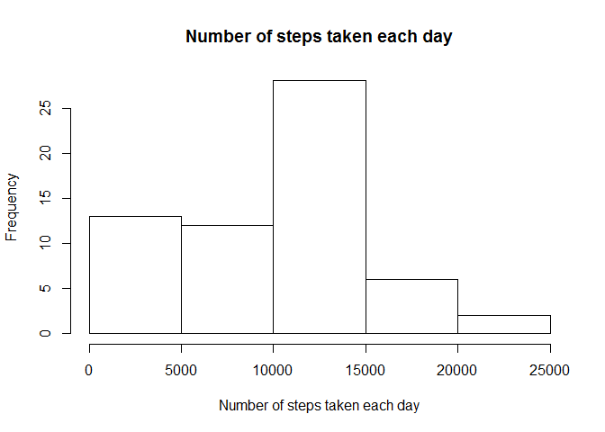
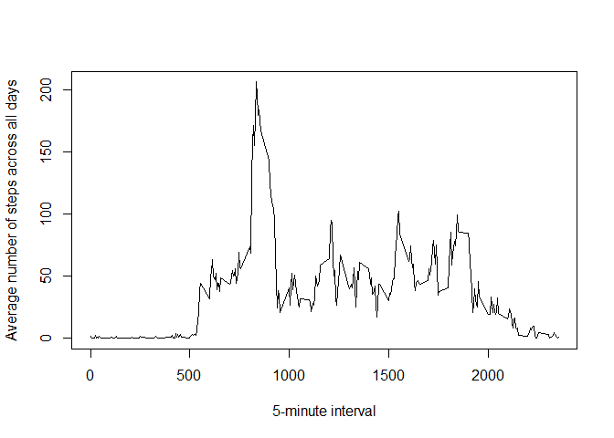
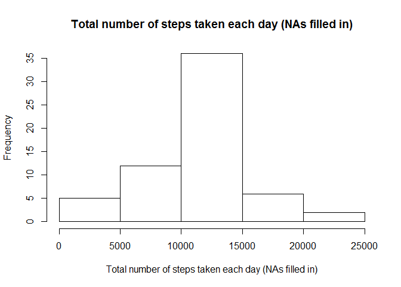
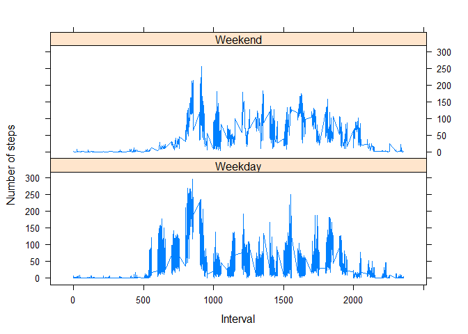

# Reproducible Research: Peer Assessment 1


## Loading and preprocessing the data

*Unzipping and loading the data*


```r
unzip("activity.zip", "activity.csv")
data <- read.csv("activity.csv")
```

*Process/transform the data using the dplyr library: creating a table data frame*


```r
library(dplyr)
data <- tbl_df(data)
```


## What is mean total number of steps taken per day?

*Calculate the total number of steps taken per day (ignoring the missing values in the dataset).*


```r
steps_day<-data %>% group_by(date) %>% summarize(daily_steps=sum(steps, na.rm=TRUE))
```

*Make a histogram of the total number of steps taken each day*


```r
hist(steps_day$daily_steps, main="Number of steps taken each day", xlab="Number of steps taken each day")
```

 

*Calculate and report the mean and median of the total number of steps taken per day (ignoring the missing values in the dataset).*


```r
mean_steps<-summarize(steps_day, mean(daily_steps))
median_steps<-summarize(steps_day, median(daily_steps))
```

- Mean of steps taken per day: **9354.2295082 steps**.
- Median of steps taken per day: **10395 steps**.


## What is the average daily activity pattern?

*Make a time series plot of the 5-minute interval (x-axis) and the average number of steps taken, averaged across all days (y-axis) (ignoring the missing values in the dataset).*


```r
daily_pattern<-data %>% group_by(interval) %>% summarize(mean_steps=mean(steps, na.rm=TRUE))
with(daily_pattern, plot(interval, mean_steps, type = "l", xlab = "5-minute interval", ylab = "Average number of steps across all days"))
```

 

*Which 5-minute interval, on average across all the days in the dataset, contains the maximum number of steps?*


```r
max_steps<-summarize(daily_pattern, which.max(mean_steps))
```

The 5-minute interval that contains the maximum number of steps, on average across all the days in the dataset is the one labelled as **835**.


## Imputing missing values

*Calculate and report the total number of missing values in the dataset (i.e. the total number of rows with NAs)*


```r
NArows<-sum(is.na(data$steps))
```

The total number of missing values in the dataset is **2304**.

*Devise a strategy for filling in all of the missing values in the dataset. The strategy does not need to be sophisticated. For example, you could use the mean/median for that day, or the mean for that 5-minute interval, etc.*

I will create a new table data frame called data2 in which the missing values are replaced by the average steps for the corresponding interval.

*Create a new dataset that is equal to the original dataset but with the missing data filled in.*


```r
data2 <- data %>% group_by(interval) %>% mutate(steps = replace(steps, is.na(steps), mean(steps, na.rm=TRUE)))
```

*Make a histogram of the total number of steps taken each day.*


```r
steps_day2<-data2 %>% group_by(date) %>% summarize(daily_steps=sum(steps))
hist(steps_day2$daily_steps, main = "Total number of steps taken each day (NAs filled in)", xlab = "Total number of steps taken each day (NAs filled in)")
```

 

*Calculate and report the mean and median total number of steps taken per day.*


```r
mean_steps2<-summarize(steps_day2, mean(daily_steps))
median_steps2<-summarize(steps_day2, median(daily_steps))
```

After filling in the NA values:
- Mean of steps taken per day: **1.0766189\times 10^{4} steps**.
- Median of steps taken per day: **1.0766189\times 10^{4} steps**.

*Do these values differ from the estimates from the first part of the assignment?*

- Mean of steps taken per day after filling in the NA values: **1.0766189\times 10^{4}**, instead of **9354.2295082** steps.
- Median of steps taken per day after filling in the NA values: **1.0766189\times 10^{4}**, instead of **10395** steps.

So yes, they do differ.

*What is the impact of imputing missing data on the estimates of the total daily number of steps?*

If instead of removing NA, we replace them by positive values, the mean and the median obviously grow.
Uusing average values to replace the NAs seems to have the effect of making the mean and the median coincide.


## Are there differences in activity patterns between weekdays and weekends?
*Use the dataset with the filled-in missing values for this part.*

*Create a new factor variable in the dataset with two levels - "weekday" and "weekend" indicating whether a given date is a weekday or weekend day.*


```r
levels <- c("Monday", "Tuesday", "Wednesday", "Thursday", "Friday", "Saturday", "Sunday")
labels <- c("Weekday", "Weekday", "Weekday", "Weekday", "Weekday", "Weekend", "Weekend")
data2 <- mutate(data2, date = as.Date(date)) %>% mutate(day = weekdays(date)) %>% mutate(label = factor(day, levels, labels))
```

*Make a panel plot containing a time series plot (i.e. type = "l") of the 5-minute interval (x-axis) and the average number of steps taken, averaged across all weekday days or weekend days (y-axis). See the README file in the GitHub repository to see an example of what this plot should look like using simulated data.*


```r
daily_pattern2 <- data2 %>% group_by(interval, label) %>% summarize(mean_steps=mean(steps))
library(lattice)
xyplot(mean_steps ~ interval | label, data=daily_pattern2,
       type = "l", xlab="Interval", ylab="Number of steps", layout = c(1,2))
```

 
